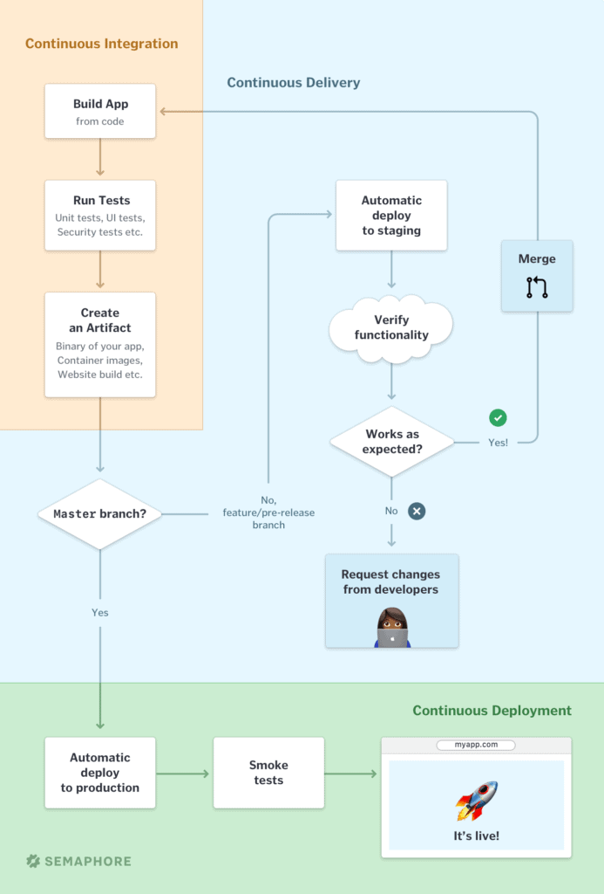

# CICD

CI/CD (Continuous Integration/Continuous Delivery) is a software development approach that emphasizes frequent integration, automated testing, and streamlined deployment.

## CI

CI (Continuous Integration) typically involves the following steps:

**1- Version Control:** Developers commit their code changes to a version control system, such as Git, which tracks changes and provides a centralized repository.

**2- Build Automation:** Whenever changes are pushed to the repository, a build process is triggered. This process involves compiling the code, resolving dependencies, and generating artifacts (e.g., executable files, libraries) needed for deployment.

**3- Automated Testing:** Automated tests, including unit tests, integration tests, and other types of tests, are executed as part of the build process. These tests help identify bugs, regressions, or compatibility issues early on.

**4- Code Quality Checks:** Static code analysis tools and linters are often used to analyze the codebase for potential issues, adherence to coding standards, and best practices.

**5- Continuous Integration Server:** A CI server (e.g., Jenkins, Travis CI, CircleCI) manages the automation of these steps, coordinating the build, test, and reporting processes.

The goal of CI is to ensure that code changes are frequently integrated, tested, and validated in a controlled and automated manner, promoting collaboration, early bug detection, and code quality improvement.

## CD

CD (Continuous Delivery) encompasses the following steps:

**1- Build and Test:** After code changes pass the CI process, the build process is triggered to create deployment artifacts. This typically involves packaging the application, configuring it, and preparing it for deployment. Automated tests are also executed to verify the functionality and quality of the built artifacts.

**2- Deployment Pipeline:** A deployment pipeline is set up to automate the steps required to release and deploy the application. This pipeline includes stages such as staging, production, or any other relevant environments, each with its own set of configurations and requirements.

**3- Environment Provisioning:** The necessary infrastructure and resources are provisioned for each stage of the deployment pipeline. This can involve creating virtual machines, containers, or serverless environments, as well as configuring networking, security, and other environment-specific settings.

**4- Deployment Automation:** The application artifacts, along with the necessary configuration files and dependencies, are deployed to the target environment(s). This can involve various deployment strategies, such as blue-green deployments, canary releases, or rolling updates, depending on the desired deployment approach and the application's requirements.

**5- Post-Deployment Testing and Validation**: Automated tests and checks are performed in the deployed environment(s) to ensure the application is functioning correctly. This can include smoke tests, integration tests, and any other relevant tests that validate the deployed application's behavior and performance.

**6- Monitoring and Feedback:** Continuous monitoring of the deployed application is crucial to identify and address any issues or anomalies. Monitoring tools and techniques are employed to collect metrics, logs, and other relevant data to provide feedback on the application's performance, availability, and user experience.

The aim of CD is to automate the release and deployment process, reducing manual intervention, increasing efficiency, and enabling rapid and reliable delivery of software to production or customer-facing environments.

**Example CI/CD workflows:**

## Scalability

In DevOps,scalability refers to the system's ability to handle increasing workload effectively. It involves designing applications and infrastructure to scale horizontally or vertically based on demand. Automated scaling, monitoring, and optimization are key practices for ensuring efficient scalability.

## High availability

High availability refers to the design and implementation of systems or applications that are built to minimize downtime and ensure uninterrupted access to services. It involves employing various strategies and technologies to eliminate single points of failure and mitigate the impact of failures or disruptions.

## Orchestration

Orchestration in DevOps refers to the coordination and management of various automated tasks, processes, and tools within the software development and deployment lifecycle. It involves the automation and integration of different components, systems, and workflows to streamline and optimize the overall software delivery process

## Virtualization

Virtualization refers to the practice of creating virtualized environments or virtual machines (VMs) to replicate and isolate different parts of the software development and deployment process. It involves using virtualization technologies to abstract and partition physical resources, such as servers, storage, and networks, to create virtual instances that can run independently.

## Containerization

Containerization refers to the practice of packaging software applications and their dependencies into lightweight, isolated containers. Containers provide a consistent and portable environment that can run consistently across different operating systems and infrastructures.

## Build tools

There are several build tools available in the DevOps ecosystem that facilitate the automation of build processes and help streamline software development. Here are a few popular examples:

**Apache Maven:** Maven is a widely used build automation and dependency management tool primarily used for Java projects. It provides a declarative approach to build configuration using XML, manages project dependencies, and supports various plugins for tasks like compilation, testing, packaging, and deployment.

**Gradle:** Gradle is a powerful build automation tool that combines the best features of Apache Ant and Apache Maven. It uses a Groovy-based DSL (Domain-Specific Language) or Kotlin script for build configuration and offers flexibility, scalability, and high-performance builds. Gradle supports building applications in multiple languages, including Java, Kotlin, Groovy, and more.

**Jenkins:** Jenkins is a popular open-source automation server that supports continuous integration and continuous delivery (CI/CD) workflows. It provides a web-based interface for configuring and running build jobs, integrates with various version control systems, and allows for the execution of custom build scripts and plugins. Jenkins supports a wide range of build tools and is highly extensible.

**Azure DevOps** (formerly known as Visual Studio Team Services or VSTS): Azure DevOps is a comprehensive DevOps platform provided by Microsoft. It offers a set of services, including version control, build automation, release management, and project tracking. Azure DevOps supports various build tools and integrates with popular ones like Apache Maven, Gradle, MSBuild, and more.

**Atlassian Bamboo:** Bamboo is a continuous integration and deployment server by Atlassian. It supports building, testing, and deploying applications across various environments. Bamboo integrates with popular build tools like Apache Ant, Apache Maven, and Gradle. It offers a visual interface for configuring build plans and provides detailed reports and notifications.

**CircleCI:** CircleCI is a cloud-based continuous integration and delivery platform. It offers a simple YAML-based configuration to define build pipelines and supports various programming languages and build tools. CircleCI can automatically trigger builds on code changes and provides easy integration with popular version control systems like GitHub and Bitbucket.

## Code analysis

Code analysis, both static and dynamic, plays a crucial role in software development to ensure code quality, identify bugs, security vulnerabilities, and optimize performance. Here's an overview of static and dynamic code analysis:

### Static Code Analysis:

Static code analysis is performed without executing the code and focuses on examining the source code or compiled bytecode to identify potential issues. It analyzes the code for syntax errors, coding standards violations, potential bugs, and security vulnerabilities. Static code analysis tools typically use static analysis techniques, such as pattern matching, data flow analysis, and control flow analysis, to analyze the code.

**Benefits of static code analysis:**
Early Bug Detection: Static analysis helps identify bugs and coding issues early in the development process, preventing them from propagating to later stages.
Code Quality Improvement: It enforces coding standards, best practices, and consistent code style, improving overall code quality and maintainability.
Security Vulnerability Detection: Static analysis tools can detect common security vulnerabilities like SQL injections, cross-site scripting (XSS), and buffer overflows.
Performance Optimization: It can identify performance bottlenecks, inefficient code patterns, and memory leaks, helping optimize code execution.
Examples of static code analysis tools:

**SonarQube**

**ESLint** (for JavaScript)

**Checkstyle** (for Java)

**PyLint** (for Python)

**RuboCop** (for Ruby)

**FindBugs** (for Java bytecode)

### Dynamic Code Analysis:

Dynamic code analysis, also known as runtime analysis, involves executing the code and analyzing its behavior during runtime. It focuses on understanding how the code behaves in real-world scenarios, including inputs, outputs, and interactions with other system components. Dynamic analysis tools typically monitor code execution, capture runtime data, and perform runtime checks to identify issues like runtime errors, memory leaks, performance bottlenecks, and security vulnerabilities.

**Benefits of dynamic code analysis:**

Real-world Scenario Testing: Dynamic analysis captures the actual behavior of the code during runtime, considering different inputs and system conditions.
Identification of Runtime Errors: It helps identify runtime errors, exceptions, null pointer dereferences, and other issues that may occur during code execution.
Performance Profiling: Dynamic analysis tools can measure code performance, identify performance bottlenecks, and provide insights into optimizing code execution.
Security Testing: It can detect runtime security vulnerabilities, such as sensitive data exposure, access control issues, and authentication failures.
Examples of dynamic code analysis tools:

**Selenium** (for web application testing)

**JUnit** (for Java unit testing)

**Apache JMeter** (for load testing)

**Valgrind** (for C/C++ memory debugging)

**OWASP ZAP** (for web application security testing)

Both static and dynamic code analysis techniques are valuable in the software development process. They complement each other and provide comprehensive insights into code quality, security, and performance. Integrating code analysis into the development workflow helps ensure the delivery of high-quality, secure, and efficient software applications.

## Artifact management

Artifact management in the context of DevOps refers to the process of managing and storing the artifacts generated during the software development and deployment lifecycle. Artifacts can include compiled code, libraries, executables, configuration files, documentation, and other deliverables that make up a software application.

Key aspects of artifact management in DevOps include:

**Repository Management:** Artifact management involves the use of repository managers to store and organize artifacts in a central location. Repository managers provide version control, dependency management, and access control capabilities. They ensure that artifacts are easily accessible, searchable, and can be reliably retrieved for different stages of the development and deployment process.

**Dependency Management:** Artifact management tools help manage dependencies between different components and libraries used in a software application. They handle the retrieval, versioning, and resolution of dependencies, ensuring that the application is built and deployed with the correct versions of the required dependencies.

**Build and Release Management:** Artifact management is closely tied to build and release management processes. Build tools and CI/CD pipelines are configured to automatically produce artifacts as part of the build process. These artifacts are then stored in the artifact repository and associated with specific versions, enabling traceability and reproducibility of builds.

**Artifact Lifecycle Management:** Artifact management encompasses the lifecycle of artifacts from creation to archival. It involves managing different versions of artifacts, promoting artifacts from one stage to another (e.g., from development to staging to production), and archiving or purging artifacts that are no longer needed.

**Security and Access Control:** Artifact management systems provide security features to control access to artifacts. They offer user authentication, authorization, and access control mechanisms to ensure that only authorized users can access and modify artifacts. This helps protect intellectual property and maintain the integrity of artifacts.

**Artifact Metadata and Search:** Artifact management tools allow the addition of metadata to artifacts, such as version numbers, descriptions, and release notes. This metadata facilitates search and discovery of artifacts, making it easier to find specific versions or components when needed.

Examples of artifact management tools in the DevOps ecosystem include:

- **Apache Maven** (for Java projects)
- **npm** (for Node.js packages)
- **Docker Registry**(for container images)
- **JFrog Artifactory**
- **Sonatype Nexus Repository Manager**
- **Microsoft Azure Artifacts**

  Artifact management is essential for maintaining traceability, repeatability, and control over the software development and deployment process. It ensures that artifacts are managed efficiently, accessible when needed, and contribute to the overall quality and reliability of the software application.

## Infrastructure as Code (IaC)

Infrastructure as Code (IaC) is an approach in DevOps that involves managing and provisioning infrastructure resources using machine-readable configuration files or code. It aims to automate the process of infrastructure deployment and configuration, treating infrastructure as software code.

Popular IaC tools include:

- **Terraform**
- **AWS CloudFormation**
- **Azure Resource Manager Templates**
- **Google Cloud Deployment Manager**
- **Ansible**
- **Puppet**
- **Chef**

Overall, Infrastructure as Code (IaC) simplifies and automates the management and provisioning of infrastructure resources, making infrastructure deployments faster, more reliable, and consistent across different environments.
