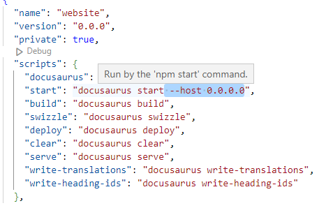

# Docker

## How to dockerize this site

Create Dockerfile

```Dockerfile
##specifies the base image for the Docker image
FROM node:18.15.0-alpine
## the working directory inside the image
WORKDIR /app
##Copies files or directories from the host machine into the image
COPY package.json /app
## Executes commands during the image build process.it can used to install dependencies
RUN npm install
## copy all in app folder
COPY . /app
## the network ports that the container listens on at runtime.
EXPOSE 3000
## Specifies the command or entry point for the container when it starts
CMD ["npm","start"]
```

then Create .dockerignore file to specify which files and directories should be excluded from the Docker build context when building a Docker image. In our case we have to ignore node_modules folder.

then add **--host 0.0.0.0** to package.json to allow your application to listen on all available network interfaces.So the application will be accessible from outside the container.

<!--  -->

```json
"scripts": {
    "docusaurus": "docusaurus",
    "start": "docusaurus start --host 0.0.0.0",
    "build": "docusaurus build",
    "swizzle": "docusaurus swizzle",
    "deploy": "docusaurus deploy",
    "clear": "docusaurus clear",
    "serve": "docusaurus serve",
    "write-translations": "docusaurus write-translations",
    "write-heading-ids": "docusaurus write-heading-ids"
  },
```

then run the command **docker build** (it used to build a Docker image based on the instructions specified in a Dockerfile)

```bash
docker build . -t image_name:v1
```

then run **docker run** command

```bash
docker run --name doc -p 8080:3000 image_name:v1
```

<!-- docker ps
docker ps -a
##remove all stopped containers from your Docker environment
docker container prune
docker run --name doc -p 8080:3000 rde:v1
docker -compose up ::::run docker compose file

-->

## Dockerization for developement

```Dockerfile
FROM node:18.15.0-alpine as build
WORKDIR /app
COPY package.json /app
RUN npm install
COPY . /app
EXPOSE 3000
RUN npm run build

## nginx:stable-alpine image is a popular base image for running NGINX web servers in Docker containers
FROM nginx:stable-alpine as deploy
WORKDIR /app
## copies the contents of the /app/build directory from the build stage to the /usr/share/nginx/html/ directory in the NGINX deployment stage.
COPY --from=build /app/build /usr/share/nginx/html/
```

<!-- docker build . -t rde:v1
docker run --name doc1 -p 8000:80 rde:v1 -->
